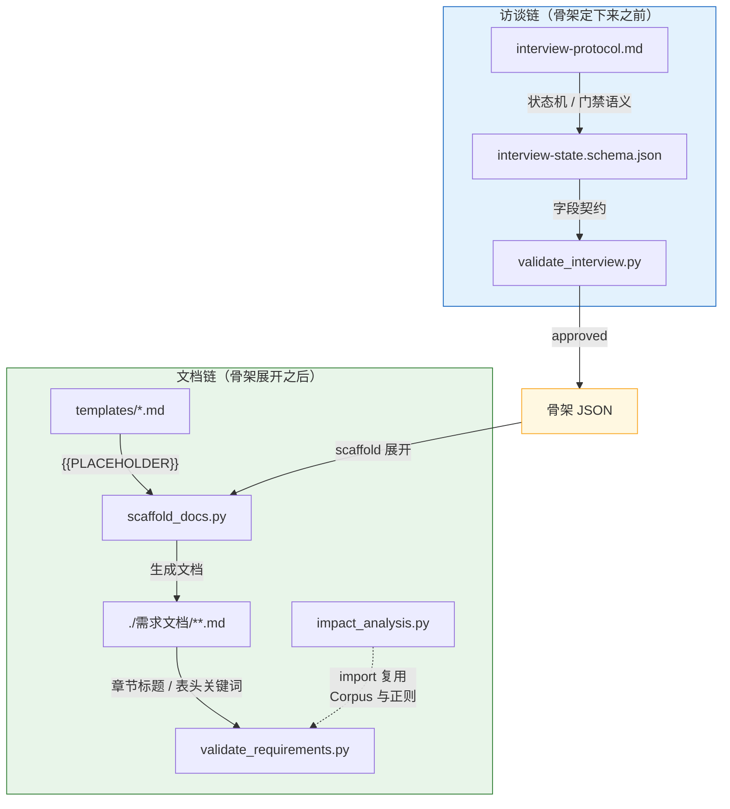

# requirement-decomposition

把零散的原始需求（口述、会议纪要、旧文档、竞品分析）转成一套互相引用、可追溯、可验证的需求文档网络，而不是一份越写越长、没人读得完的大文档。

核心结构是总分：一份**综述**承担全局索引、非功能需求、术语、关系矩阵；每个**功能模块**一份独立文档，只写自己的事，通过 ID 引用回综述；若干**端到端场景切片**横穿多个模块，反向验证拆分是否合理。

两个机制保证这套网络可信：**阻塞式访谈**——骨架经人批准前不展开目录，边界错误不会被复制进几十份文档；**里程碑评审**——内容背书集中在一个事件里完成，打回走修复回路直到全量通过，终点是全库终稿、零草稿残留。

## 它解决什么问题

| 痛点 | 这个技能怎么做 |
|------|----------------|
| 需求文档越写越长没人读 | 总分结构：综述管全局，模块只写自己的事，通过 ID 互引 |
| 改一处边界要返工整批文档 | 骨架先定，访谈阻塞确认后才展开；骨架错了只改骨架 |
| ID 悬空、链接断裂没人查 | 八个脚本做机器护栏，十六项一致性检查 |
| 术语混用、同义替换 | 术语表禁用同义词列，C07 全文扫描 |
| 版本号各写各的 | C11 卡三段号 + 变更记录一致 |
| 文档状态没人管 | C15 状态机 + `--snapshot` 基线门禁 |
| 改了文档忘了退回草稿 | `impact_analysis` 状态未回退检测 |
| 复核确认无需改动却要空转版本号 | `--cleared` 复核销项，门禁只拦真正的未同步 |
| 流程走完文档还停在草稿 | 里程碑评审事件：背书集中一次完成，收敛于全库终稿 |
| 评审结论交付后没人记得 | 批准/打回落盘进版本快照的「评审记录」节 |
| 改了一份不知道波及谁 | 关系矩阵邻接传播，受影响文档全部列出 |

## 环境要求

- Python 3.11+
- 八个脚本只依赖 Python 标准库，无需安装第三方包

## 快速开始

### 展开

骨架 JSON 是格式的唯一权威来源（`--print-schema` 的示例本身就是一份合法骨架）：

```bash
cd $(mktemp -d)
S=/path/to/requirement-decomposition/scripts
python3 $S/scaffold_docs.py --print-schema > skeleton.json
python3 $S/scaffold_docs.py skeleton.json -o ./需求文档
```

### 校验

```bash
python3 $S/validate_requirements.py ./需求文档          # 全量
python3 $S/validate_requirements.py ./需求文档 --strict   # 定稿门禁，警告也算失败
python3 $S/validate_requirements.py ./需求文档 --only C04,C05  # 只跑指定项
```

空白骨架期望：ERROR 0，仅 C04/C16 若干 WARN + C06/C09/C15 若干 INFO，退出码 0。

### 其他脚本

```bash
python3 $S/manual_review_checklist.py ./需求文档          # 人工复核清单
python3 $S/impact_analysis.py --dir ./需求文档 --base origin/main --fail-on-unsynced
# 复核确认无需改动的受影响文档：--cleared 清单.txt（路径或 MOD/UC/ADR 的 ID）
python3 $S/self_check.py                                   # 技能包内部契约自检
python3 $S/validate_interview.py --print-example           # 访谈状态样例
```

## 六轮工作流

| 轮 | 做什么 | 跑什么校验 |
|----|--------|------------|
| 1 · 骨架 | 通读原始材料，产出骨架 JSON | 预演展开（scaffold 到临时目录） |
| 2 · 访谈确认 | 阻塞式单问题回合，逐条问实骨架 | `validate_interview.py` |
| 3 · 逐模块生成 | 展开目录，逐模块填写 | `--only C02,C03,C04,C07` |
| 4 · 全局审查 | 跨模块一致性（不做状态转移，全库保持草稿） | 全量默认 |
| 5 · 场景编写 | 端到端场景切片，走查不通回改模块 | `--only C02,C03,C14` |
| 6 · 版本规划与里程碑评审 | 版本计划 + 全库内容背书 | `--strict` → 评审（打回回路收敛）→ `--snapshot` → 转已冻结 |

全流程只有**两个人工触点**：第 2 轮的骨架批准（骨架错误会被复制进几十份文档，必须人定）与第 6 轮的里程碑评审（「已评审」是人类背书，生成方自封即为假）。其余环节全部是机器门禁。完整流程见 `requirement-decomposition/SKILL.md`。

## 生命周期与里程碑评审

每份文档三个状态：`草稿 → 已评审 → 已冻结`；改已评审或已冻结的文档，先把状态退回草稿。

- **草稿是生成期的诚实中间态**。第 3~5 轮全库保持草稿，场景走查不通回改模块时不背状态成本。
- **背书集中在里程碑评审**。机器备料（`--strict` 清零 + 复核清单 + diff 摘要）→ 人评审一次（整体通过或逐份打回并写明理由）→ 打回走修复回路：先判修复动没动对外契约面（七项，见 `references/decomposition-rules.md` §8.7），动了则受影响邻接的批准作废、并入增量重审——事件收敛于全量通过，不许结束于打回。
- **定稿**：转已评审 → `--snapshot` 打基线 → 转已冻结 → C15 复验。批准与打回连同理由登记进版本快照的「评审记录」节。

机器强制点各有分工：`--strict` 守评审入口，`--snapshot` 守基线入口，`impact_analysis` 的状态未回退检测守退回，C15 反向盯「进了基线却没转已冻结」，C16 盯 ADR 长期挂「提议」。

## 八个脚本

| 脚本 | 职责 |
|------|------|
| `scaffold_docs.py` | 骨架 JSON -> 展开整套文档目录 |
| `validate_requirements.py` | C01~C16 十六项一致性校验 + `--snapshot` 基线门禁 |
| `validate_interview.py` | 第 2 轮访谈契约校验（fail closed） |
| `impact_analysis.py` | 变更影响分析 + 状态未回退检测 + 复核销项 |
| `manual_review_checklist.py` | 列出脚本管不到、需人工过的复核项 |
| `run_routing_evals.py` | 触发边界用例校验 |
| `build_view.py` | 按视图配方把多个模块的指定章节拼成聚合视图 |
| `self_check.py` | S01~S20 技能包内部契约自检 |

## 十六项检查

| 编号 | 检查项 |
|------|--------|
| C01 | 文档结构与必需文件 |
| C02 | ID 定义与引用完整性 |
| C03 | 相对链接可达性 |
| C04 | NFR 全覆盖声明 |
| C05 | 关系矩阵合法性、对称性与环路检测 |
| C06 | 需求跟踪矩阵与验收双向追溯 |
| C07 | 术语一致性（禁用同义词） |
| C08 | 写作规范（禁用词） |
| C09 | 占位符与未决项统计 |
| C10 | 表格结构与豁免标记卫生 |
| C11 | 文档版本一致性 |
| C12 | 模块体量合理性 |
| C13 | 数据写主唯一性与术语表交叉核对 |
| C14 | Mermaid 图内模块 ID |
| C15 | 文档状态一致性（含基线反向核对） |
| C16 | 终态文档引用与决策结论完整性 |

另有 S01~S20 二十项内部契约自检，管住模板、脚手架、校验器三层的一致性。详见 `requirement-decomposition/references/quality-gates.md`。

## 架构：三层契约

模板、脚手架、校验器三者靠字符串约定耦合，任何一层单独改都会静默失效。`self_check.py` 守着这三层的一致性。



两条链各自独立：访谈链管「骨架定下来之前」，文档链管「骨架展开之后」。交接点是骨架 JSON。

## 独立性

这个技能包不依赖外部网站、托管平台，也不假设自己身处哪一套技能生态。三处曾经的耦合已在 1.0.2 清掉：schema 的 `$id` 用 URN、CI 模板用 `REPLACE_WITH_SKILL_PATH` 占位、evals 的 `route_to` 用能力类别而非兄弟技能名。

## 目录结构

```
requirement-decomposition/
├── SKILL.md                  # 技能完整工作流
├── CHANGELOG.md              # 变更记录
├── assets/
│   ├── ci/                   # CI 模板（GitHub Actions / pre-commit）
│   └── templates/            # 八份空白模板
├── references/               # 人读版规则
│   ├── decomposition-rules.md
│   ├── document-templates.md
│   ├── interview-protocol.md
│   ├── optional-extensions.md
│   ├── quality-gates.md
│   └── writing-style.md
├── schemas/
│   └── interview-state.schema.json
├── scripts/                  # 八个 Python 脚本
└── evals/
    └── routing-evals.json
```

## 许可

MIT 许可，详见 [LICENSE](./LICENSE)。

## 版本

版本号遵循语义化版本，变更记录见 [CHANGELOG.md](./requirement-decomposition/CHANGELOG.md)。当前版本见 `requirement-decomposition/SKILL.md` frontmatter。
