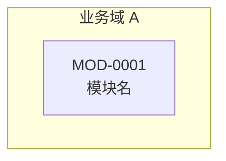

# {{PROJECT}} 需求综述

> 本文档是需求文档网络的入口，所有模块文档与场景切片从此处索引。全文术语以《[术语表](./01-术语表.md)》为准，不作同义替换。

| 项 | 值 |
|------|------|
| 文档版本 | V1.0.0 |
| 更新日期 | {{DATE}} |
| 状态 | {{STATUS}} |

## 1. 系统概述与范围

### 1.1 背景

[待确认: 业务背景与要解决的问题]

### 1.2 目标

| # | 目标 | 衡量方式 |
|---|------|----------|
| 1 | [待确认: 目标描述] | [待确认: 可量化的达成标准] |

### 1.3 范围外

本期明确不做的事。此表是后续需求争议的裁决依据。

| # | 不做的事 | 原因 | 后续版本是否考虑 |
|---|----------|------|------------------|
| 1 | [待确认] | [待确认] | 否 |

### 1.4 系统上下文图

```mermaid
graph TB
    subgraph 本系统
        SYS[{{PROJECT}}]
    end
    ACTOR1[角色 A] --> SYS
    SYS --> EXT1[外部系统 A]
```

### 1.5 角色与权限

| 角色 | 职责 | 可触达模块 |
|------|------|------------|
| [待确认] | [待确认] | [待确认] |

## 2. 全局非功能需求（NFR）

指标必须可测量。写不出阈值的先标 `[待确认]`，不用形容词代替。

| NFR ID | 类别 | 指标描述 | 量化阈值 | 测量方式 | 违反后果 |
|--------|------|----------|----------|----------|----------|
{{NFR_ROWS}}

未涉及的类别在此说明理由：

| 类别 | 本期是否涉及 | 说明 |
|------|--------------|------|
| 性能 | 是 | —— |
| 可用性 | 是 | —— |
| 安全 | 是 | —— |
| 合规 | [待确认] | [待确认] |
| 可维护性 | [待确认] | [待确认] |
| 兼容性 | [待确认] | [待确认] |
| 可观测性 | [待确认] | [待确认] |
| 可访问性/国际化 | [待确认] | [待确认] |

## 3. 术语表

完整术语见《[术语表](./01-术语表.md)》。文档网络内所有名词以标准名出现，禁用同义词列已登记的说法不得使用。

## 4. 功能结构图

### 4.1 分层包含图



### 4.2 依赖关系图

实线为强依赖，虚线为弱依赖，边上标关系类型。


### 4.3 数据流图

边上标注流转的数据实体名，实体名取自术语表。


## 5. 模块索引

| 模块 ID | 名称 | 目标 | 文档 | 关系概述 | 引入版本 | 状态 |
|---------|------|------|------|----------|----------|------|
{{MODULE_INDEX_ROWS}}

状态取值与转移条件见 `references/decomposition-rules.md` 第 8 节。本列是视图，权威源是各模块文档头部的状态行，两处不一致时 C15 报错。ID 一经分配永不复用。

## 6. 关系矩阵

关系类型与置信度取值以 `references/decomposition-rules.md` 第 5、6 节为准（当前十种类型、三种置信度），此处不内联列词表——词表是单一事实源，模板里再抄一份会随词表漂移。弱依赖必须填降级策略。

| 源模块 | 目标模块 | 关系类型 | 关系描述 | 置信度 | 依赖强度 | 降级策略 |
|--------|----------|----------|----------|--------|----------|----------|
{{RELATION_ROWS}}

任一关系必须同时出现在双方模块文档的「关系本地视图」中，方向互补。

## 7. 需求跟踪矩阵

主表见《[需求跟踪矩阵](./02-需求跟踪矩阵.md)》。

## 8. 全局跨模块规则

跨两个以上模块的通用约定集中于此，模块文档引用规则 ID，不复述内容。

| 规则 ID | 规则 | 适用模块 | 说明 |
|---------|------|----------|------|
| RULE-0001 | [待确认: 例如时间格式、金额精度、幂等键约定] | 全部 | [待确认] |

## 9. 移交事项

需求拆解到此为止，下列事项超出本文档网络的职责，交给别处决定。写在这里是为了让「谁接手」有据可查——只在对话里说过的移交，交付之后就没人记得。

| # | 事项 | 为什么不在本网络内定 | 移交给 | 相关模块 | 未决时的影响 |
|---|------|----------------------|--------|----------|--------------|
| 1 | [待确认: 如「订单表分库分表策略」] | [待确认: 如「属于技术方案，需求只约束数据一致性要求」] | [待确认: 承接方或文档名] | [待确认] | [待确认] |

判据：本节写**需求已定、实现方式未定**的事，例如技术选型、部署拓扑、接口协议、库表设计。需求本身没定的事不写这里，那是 `[待确认]` 或未决项。

## 10. 变更记录

| 版本 | 日期 | 变更人 | 变更内容 | 影响文档 |
|------|------|--------|----------|----------|
| V1.0.0 | {{DATE}} | —— | 初始骨架 | —— |
