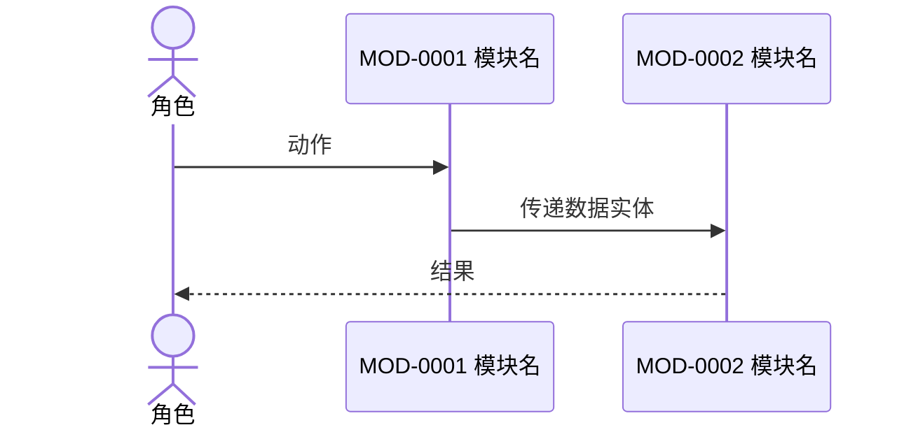

# {{UC_ID}} {{UC_NAME}}

> 本文档需结合《[综述](../00-综述.md)》与《[术语表](../01-术语表.md)》阅读。引用的模块流程步骤编号必须与模块文档一致。

## 1. 场景信息

| 项 | 值 |
|------|------|
| 场景 ID | {{UC_ID}} |
| 文档版本 | V1.0.0 |
| 状态 | {{STATUS}} |
| 业务价值 | [待确认: 这条旅程走通后业务上得到什么] |
| 触发方式 | [待确认: 用户操作 / 定时 / 外部事件] |
| 参与角色 | [待确认] |
| 涉及模块 | [待确认] |
| 场景类型 | [待确认: 正常 / 备选 / 异常 / 边缘 / 性能 / 安全 / 灾难恢复 / 迁移 / 多端 / 弱网 / 可访问性 / 国际化] |
| 更新日期 | {{DATE}} |

## 2. 模块顺序流

## 3. 步骤详解

| 序号 | 触发模块 | 输入 | 处理 | 输出 | 流向 |
|------|----------|------|------|------|------|
| 1 | [待确认] | [待确认] | [待确认] | [待确认] | [待确认] |

## 4. 数据传递

跨模块传递的数据实体，标明产生与消费的步骤号。

| 数据实体 | 关键字段 | 产生步骤 | 消费步骤 | 一致性要求 |
|----------|----------|----------|----------|------------|
| [待确认] | [待确认] | [待确认] | [待确认] | [待确认] |

## 5. 异常路径

至少覆盖两条真实可能的失败路径，关联到模块文档的异常流编号。

| 编号 | 失败点 | 失败原因 | 系统表现 | 补偿或回退动作 | 关联模块异常流 |
|------|------|--------|----------|----------|----------------|
| X1 | [待确认] | [待确认] | [待确认] | [待确认] | [待确认] |

## 6. 拆分验证结论

跑通本场景时，模块划分暴露的问题记录在此。这是反向验证拆分合理性的产出。

| 发现 | 影响模块 | 处理 |
|------|----------|------|
| —— | —— | 无 |

## 7. 变更记录

| 版本 | 日期 | 变更人 | 变更内容 | 影响文档 |
|------|------|--------|----------|----------|
| V1.0.0 | {{DATE}} | —— | 初始骨架 | —— |
